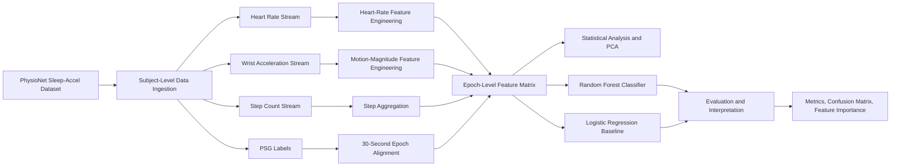

# SleepStage AI: PSG-Aligned Wearable Signal Modeling for Sleep Stage Classification

**SleepStage AI** is a research-oriented machine learning project for classifying sleep stages using wearable physiological signals aligned with polysomnography-labeled sleep-stage epochs. The project uses heart rate, wrist accelerometry, and step-count streams from the PhysioNet Sleep-Accel dataset to build an end-to-end ML workflow for data ingestion, 30-second epoch alignment, physiological feature engineering, statistical analysis, dimensionality reduction, supervised classification, model evaluation, reproducibility, and responsible interpretation.

The project investigates how AI can extract physiologically meaningful sleep-stage structure from synchronized wearable streams and support multimodal sleep-study interpretation, latent biomarker discovery, and scalable sleep-health analytics.

---

## System Architecture



---

## Research Question

Can machine learning classify sleep stages from synchronized wearable streams aligned to PSG stage labels, and can these signals reveal physiological structure that supports multimodal sleep-study interpretation?

---

## Problem Context

Polysomnography is the gold-standard clinical method for studying sleep. A PSG study records multiple physiological signals, including brain activity, eye movement, muscle tone, airflow, oxygen saturation, ECG, heart rate, and body movement. These signals capture a detailed picture of human physiology during sleep, but clinical scoring workflows often focus on a narrower subset of manually interpreted channels.

This project studies whether AI can use synchronized wearable signals such as heart rate, wrist movement, and steps to identify sleep-stage structure. The research frames wearable streams as physiologically informative signals that can complement PSG labels and support broader sleep-study interpretation, scalable sleep-stage modeling, and future multimodal clinical decision-support research.

---

## Research Hypothesis

Different sleep stages produce distinguishable physiological patterns across wearable signals. Deep sleep is expected to show lower movement and more stable autonomic behavior, REM sleep may show characteristic autonomic fluctuation, and wakefulness may show higher activity. A supervised model trained on PSG-aligned wearable features should learn meaningful sleep-stage structure above chance-level prediction and support interpretation of latent physiological patterns.

---

## Dataset

This project uses the PhysioNet dataset **Motion and heart rate from a wrist worn wearable and labeled sleep from polysomnography** by Walch et al.

Dataset source: https://physionet.org/content/sleep-accel/1.0.0/

Each subject includes synchronized files for:

- PSG sleep-stage labels
- Heart rate
- Wrist accelerometry
- Step count

Sleep-stage labels are represented as 30-second epochs with classes including Wake, N1, N2, N3, and REM. The dataset is suitable for epoch-level supervised learning, physiological signal analysis, feature engineering, and sleep-stage classification.

---

## Variables and Modeling Target

| Category | Variables |
|---|---|
| Input signals | Heart rate, wrist acceleration, step count, derived motion magnitude |
| Engineered features | Heart-rate statistics, motion statistics, step aggregates, epoch-level feature summaries |
| Target label | PSG sleep-stage label per 30-second epoch |
| Modeling task | Multi-class sleep-stage classification |
| Analysis level | Subject-level wearable streams aligned to PSG epochs |

Potential confounders include subject-level physiology, age, sex, health status, medication use, caffeine, inter-subject variability, and sleep-lab conditions. The project design emphasizes subject-aware evaluation, within-subject normalization, and careful interpretation of wearable-derived signals.

---

## Methodology

The workflow follows a structured ML research pipeline:

1. Retrieve subject-level PhysioNet files
2. Parse PSG labels, heart rate, acceleration, and step-count streams
3. Clean timestamps and signal tables
4. Assign records to 30-second PSG epochs
5. Engineer heart-rate statistics
6. Compute motion magnitude from acceleration axes
7. Aggregate step-count features
8. Align engineered features with PSG labels
9. Analyze feature distributions across sleep stages
10. Perform statistical comparison across stage groups
11. Apply PCA for low-dimensional structure exploration
12. Train Random Forest classifier for nonlinear tabular modeling
13. Train Logistic Regression baseline for interpretable comparison
14. Evaluate accuracy, confusion matrix, per-class metrics, and feature importance
15. Document limitations, ethics, and reproducibility considerations

---

## Technical Contribution

This repository contributes a modular research pipeline for PSG-aligned wearable sleep-stage modeling. The main technical contributions include:

- Reusable PhysioNet ingestion utilities
- Epoch-level preprocessing and alignment workflow
- Heart-rate, motion, and step-count feature engineering
- Statistical analysis utilities for stage-wise comparison
- Supervised classification pipeline with Random Forest and Logistic Regression
- Evaluation utilities for accuracy, classification reports, confusion matrices, and feature importance
- Visualization utilities for PCA, sleep-stage distributions, and model interpretation
- CI-enabled testing workflow with pytest
- Docker-based reproducibility support
- Schema and experiment-tracking structure for research rigor

---

## Repository Structure

```text
.
├── notebooks/
│   └── sleepstage_ai_psg_wearable_analysis.ipynb
├── src/
│   ├── __init__.py
│   ├── data_ingestion.py
│   ├── preprocessing.py
│   ├── feature_engineering.py
│   ├── statistical_analysis.py
│   ├── modeling.py
│   ├── evaluation.py
│   └── visualization.py
├── docs/
│   ├── research_report.md
│   ├── model_card.md
│   ├── data_card.md
│   ├── ethics_privacy.md
│   └── reproducibility.md
├── experiments/
│   └── experiment_log_template.csv
├── schemas/
│   └── epoch_feature_schema.json
├── results/
│   ├── figures/
│   ├── metrics/
│   └── reports/
├── tests/
│   ├── test_preprocessing.py
│   └── test_feature_engineering.py
├── .github/workflows/
│   └── ci.yml
├── Dockerfile
├── pytest.ini
├── README.md
├── requirements.txt
├── .gitignore
└── CITATION.cff
```

---

## Technical Stack

| Area | Tools |
|---|---|
| Programming | Python |
| Data Processing | pandas, NumPy |
| Statistical Analysis | SciPy |
| Machine Learning | scikit-learn |
| Visualization | Matplotlib, Seaborn |
| Notebook Workflow | Google Colab / Jupyter |
| CI/CD | GitHub Actions |
| Testing | pytest |
| Reproducibility | Docker, requirements.txt, pytest.ini |

---

## Model Development

The project includes two supervised learning approaches:

- **Random Forest Classifier** for nonlinear tabular feature modeling and feature-importance analysis
- **Logistic Regression Baseline** for interpretable baseline comparison after feature scaling

Model evaluation focuses on:

- Accuracy
- Confusion matrix
- Classification report
- Per-class precision, recall, and F1-score
- Feature importance
- PCA-based structure exploration

---

## Evaluation Framework

The evaluation framework is designed to assess both predictive performance and physiological interpretability.

| Evaluation Area | Purpose |
|---|---|
| Accuracy and F1-score | Measure classification performance across sleep stages |
| Confusion matrix | Identify stage-level misclassification patterns |
| Feature importance | Interpret contribution of wearable-derived features |
| PCA projection | Explore separability and latent structure in engineered features |
| Statistical comparison | Evaluate whether physiological features differ across sleep stages |
| Reproducibility checks | Validate preprocessing and feature-engineering logic through tests |

---

## Documentation Index

| Document | Purpose |
|---|---|
| [Research Report](docs/research_report.md) | Research framing, methodology, and evaluation summary |
| [Model Card](docs/model_card.md) | Model purpose, inputs, outputs, limitations, and intended use |
| [Data Card](docs/data_card.md) | Dataset source, structure, privacy, and representativeness notes |
| [Ethics and Privacy](docs/ethics_privacy.md) | Responsible use and clinical-scope boundaries |
| [Reproducibility](docs/reproducibility.md) | Environment, dataset access, and reproducibility practices |

---

## Reproducibility and Engineering Quality

The repository includes modular source code, dependency specifications, documentation, testing, CI validation, Docker support, and experiment-tracking structure. Reproducibility is supported through:

- Public PhysioNet dataset access
- Subject-level ingestion utilities
- Deterministic model random states where applicable
- Documented preprocessing and feature-engineering logic
- Research notebook for traceability
- Reusable Python modules for pipeline execution
- GitHub Actions validation workflow
- Pytest-based checks for core transformations
- Docker environment for controlled execution

---

## Ethics and Clinical Scope

This project is a research prototype for physiological signal analysis and sleep-stage classification. It is not a clinical diagnostic system, medical device, or substitute for professional sleep-medicine interpretation.

Physiological data can encode sensitive behavioral and health-related patterns. Model outputs should be interpreted as research signals requiring validation, not as clinical conclusions. Any future clinical use would require rigorous external validation, prospective testing, bias analysis, privacy review, and medical oversight.

---

## Future Research Directions

Planned research extensions include:

- Subject-wise train/test splits to reduce leakage across individuals
- Expanded multi-subject evaluation
- Class-imbalance analysis across sleep stages
- Additional time-series features such as rolling heart-rate variability and motion entropy
- Deep learning baselines for temporal modeling
- Model calibration and uncertainty estimation
- Broader multimodal integration with PSG signal channels
- Experiment tracking with repeated subject-level validation
- Deployment-oriented API prototype for research demonstration

---

## Project Scope

SleepStage AI is designed as an applied AI research project for wearable physiological signal modeling and PSG-aligned sleep-stage classification. It emphasizes reproducible experimentation, interpretable feature engineering, supervised ML evaluation, and responsible framing for biomedical signal analysis.
